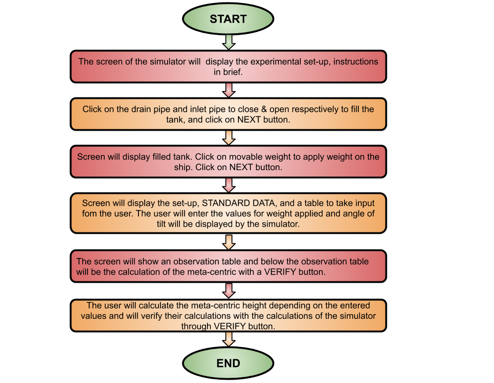
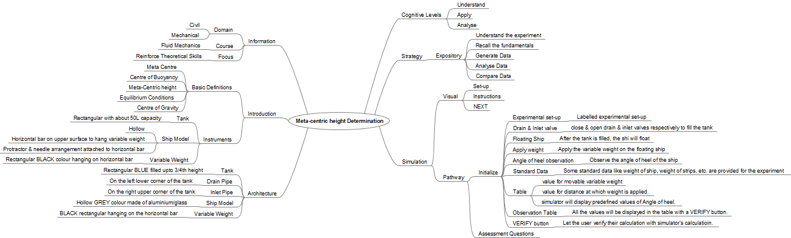

## Storyboard (Round 2)

Experiment: To determine the meta-centric height of the given ship model.

### 1. Story Outline:

The experimental set-up involves a hollow ship model floating in a tank filled with water. The ship model consists of the outer body of the ship, a horizontal weight hanger, a protactor attached on the weight hanger and a needle attached to the protactor.  
When the user applies different weights at different distances from the vertical axis, they obtain different values for angle of heel for each set of experiment conducted. After knowing the angle of heel , weight applied, and distance at which weight is applied, user can calculate the meta-centric height of the ship model. This meta-centric height will give the user the idea whether the body will be in equilibrium condition or in non-equilibrium condition.

### 2. Story:

The complete experiment revolves around the calculation of meta-centric height of a given ship model. This experiment requires the user to have prior knowledge of meta Centre, Centre of gravity, meta-centric height, and buoyancy. Whenever a body, floating in a liquid is given a small angular displacement, it starts oscillating about some point, this point about which the body starts oscillating is called Meta Centre. A point from which the weight of a body or system may be considered to act is known as Centre of gravity. The distance between the center of gravity of a floating body and the meta Centre is called meta-centric height. Buoyancy (Fb) (also known as the buoyant force) is the force exerted on an object that is wholly or partly immersed in a fluid.

#### 2.1 Set the Visual Stage Description:
The experimental set-up consists of rectangular tank made of glass (assumed) of about 50L capacity kept on a vertical stand, tank having a drain pipe to drain the filled water after the experiment and an inlet pipe to fill the tank with water for experiment. A hollow ship model made of any material, be it aluminum or glass, is kept in the tank. On the upper horizontal surface of the ship there is a horizontal bar attached, used to hang the weight and a protractor & a needle is also attached at the midpoint of the bar, which is used to take the reading for angle of heel. 
When the user gets to start the experiment, firstly he turns off the knob of drain pipe and then opens the knob of inlet pipe to allow water to be filled in the tank upto the height of 3/4th of the height of the tank. As the water is filled in the tank the ship floats in the tank and it is assumed that the ship is in equilibrium condition. When the user applies the weight on the horizontal bar, the ship tilts in the direction of application of the weight and the needle deflects in the opposite direction of the application of the weight.
The user can observe the angle of heel from the protractor and note it down. Now this reading can be used to calculate the meta-centric height of the ship model using the formula1 of meta-centric height, and the user will now be able to infer the equilibrium & non-equilibrium conditions for the floating body. After calculating the meta-centric height, the user can verify their calculations with that of simulator’s calculations through VERIFY button.

#### 2.2 Set User Objectives & Goals:
1.	The prime objective of this experiment is to make the user well aware with the concepts of meta-centric height and its applications in the  real world. 
2.	To compare the experimental and theoretical values & analyze the difference observed. 
3.	To analyze the relation between the weight applied, distance at which weight is applied & angle of heel. 
4.	To understand the conditions for equilibrium & non-equilibrium states of floating body. 
5.	Attempt the assessment questions.

#### 2.3 Set the Pathway Activities:

<ol><li>The first screen of simulator is the experimental set-up consisting of an empty rectangular tank kept on a vertical stand. The tank contains a ship model to carry out the experiment with. The tank have a drain pipe and an inlet pipe to drain and fill the tank respectively.
</li>
<li>The user closes the knob of the drain pipe and opens the inlet pipe to fill the tank with with water upto 3/4th height of the tank. As the tank is filled with water, the ship floats in the water and is assumed to be in equilibrium condition.</li>
<li>Now the user applies the Weight on either side of the needle and at any distance to provide angular displacement to the ship.</li>
<li>On the next screen, the user can observe the angle of heel of the ship. A table will be displayed in the right which asks the user for the value of applied weight and distance of application of weight.</li>
<li>Based on the values entered by the user for weight and distance, a value for angle of heel will be displayed by the simulator which is obtained by performing the real experiments on standard conditions.</li>
<li>Now on the NEXT screen of the simulator, some standard data used and an observations table will be shown containing the entered values by the user and the calculated value of the meta-centric height of the ship model. Also the user gets an option to verify their set of calculations with the calculations of the simulator.</li></ol>

##### 2.4 Set Challenges and Questions/Complexity/Variations in Questions:

<ol>
<li>Formula to calculate the meta-centric height (GM)?
<ol><li>(W * x)/(w * tan &theta;)</li>
<li>(x * tan &theta;)/(x * W)</li>
<li>(W * tan &theta;)/(w * x)</li>
<li>(w * x)/(W * tan &theta;)</li></ol>
</li>
<li>The angle of tilt of a ship:
<ol><li>Is independent of weight applied.</li>
<li>Is independent of distance at which weight is applied.</li>
<li>Depends on both, weight applied and distance at which weight is applied.</li>
<li>None of the above.</li></ol></li>
<li>A point from which the  weight of the body may be considered to act is known as:
<ol><li>Meta - Centre</li>
<li>Centre of gravity</li>
<li>Centre of  Bouyancy</li>
<li>None of the above</li></ol></li>
<li>What is the condition for the equilibrium of the floating body?
<ol><li>Meta centre lies above centre of gravity.</li>
<li>Meta centre lies below centre of gravity.</li>
<li>Meta centre coincides with centre of gravity.</li>
<li>None of the above.</li></ol></li>
<li>What is the formula to calculate force of buoyancy?
<ol><li>Fb=(Vs * D)/g</li>
<li>Fb=(Vs * g)/D</li>
<li>Fb=Vs * D * g</li>
<li>Fb=(D * g)/ Vs</li></ol></li>
</ol>

##### 2.5 Allow pitfalls:
NIL.

##### 2.6 Conclusion:
<ul><li>At the end of the experiment, the user should be able to calculate meta-centric height of any floating body.</li>
<li>After performing the experiment, the user can infer the equilibrium conditions for the floating body.</li>
<li>The approximate time required to understand the protocols to perform the experiment would take about 5 minutes. To perform the experiment and generate data would take another 3-5 minutes and another 3-5 minutes will be required to calculate the values. Answering the assessment questions will take about 3-5 minutes. Thus total time required to perform the experiment will require around 20 minutes</li></ul>

##### 2.7 Equations/formulas: NA
#1:- meta-centric height, GM = (w * x)/(W * tan &theta;) 
&emsp; &emsp; &emsp;Where,  
&emsp; &emsp; &emsp; &emsp;w= applied weight. 
&emsp; &emsp; &emsp; &emsp;W= Weight of ship=8.55kg (assumed). 
&emsp; &emsp; &emsp; &emsp;x= distance at which weight is applied. 
&emsp; &emsp; &emsp; &emsp;&theta; = angle of heel. 

### 3. Flowchart 4
 

### 4. Mindmap:
 

### 5. Storyboard :
Storyboard: <a href="storyboard/storyboard.png"> [here]</a>

